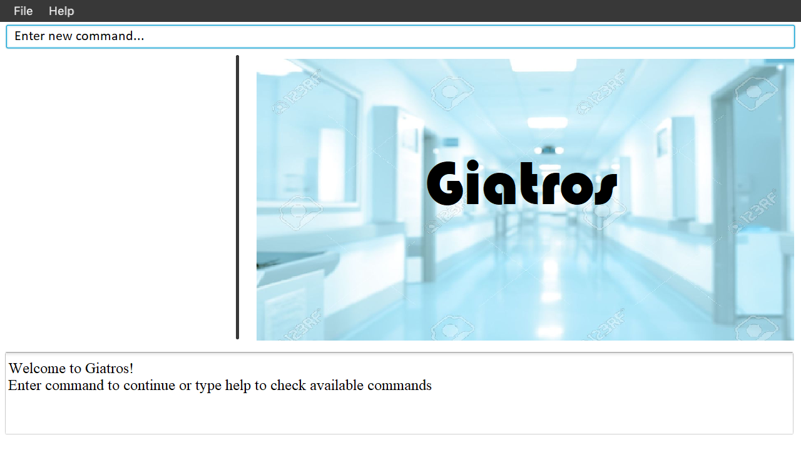
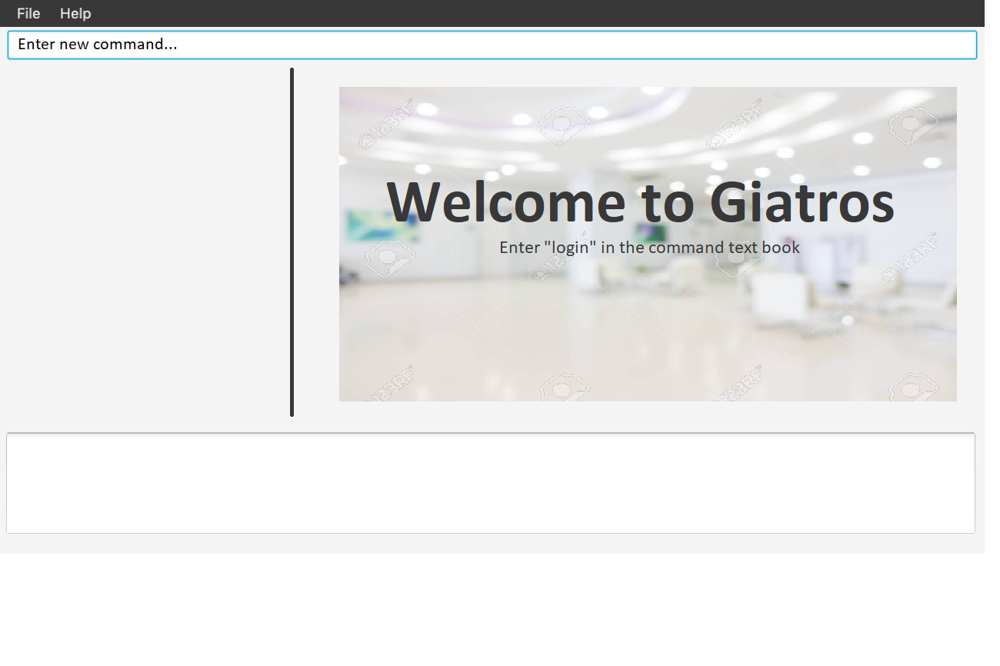

= Giatros
ifdef::env-github,env-browser[:relfileprefix: docs/]

https://travis-ci.org/CS2103-AY1819S2-W13-4/main[image:https://travis-ci.org/CS2103-AY1819S2-W13-4/main.svg?branch=master[Build Status]]
https://ci.appveyor.com/project/chuaes/main-erei4[image:https://ci.appveyor.com/api/projects/status/l0jp6ewmhauhmsr0?svg=true[Build status]]
https://coveralls.io/github/CS2103-AY1819S2-W13-4/main?branch=master[image:https://coveralls.io/repos/CS2103-AY1819S2-W13-4/main/badge.svg?branch=master[Coverage Status]]

ifdef::env-github[]

endif::[]

ifndef::env-github[]

endif::[]

* This is a desktop Giatros application. It has a GUI but most of the user interactions happen using a CLI (Command Line Interface).
* It is a Java sample application intended for hospital staff to manage the patients' record.
* This application contains:
** A more sophisticated GUI that includes a list  panel and an in-built Browser.
** More test cases, including automated GUI testing.
** Support for _Build Automation_ using Gradle and for _Continuous Integration_ using Travis CI.

== Site Map

* <<UserGuide#, User Guide>>
* <<DeveloperGuide#, Developer Guide>>
* <<AboutUs#, About Us>>
* <<ContactUs#, Contact Us>>

== Acknowledgements

* Some parts of this sample application were inspired by https://github.com/nus-cs2103-AY1819S1/AddressBook-level4[AddressBook4].
* Libraries used: https://github.com/TestFX/TestFX[TextFX], https://github.com/FasterXML/jackson[Jackson], https://github.com/google/guava[Guava], https://github.com/junit-team/junit5[JUnit5]

== Licence : link:LICENSE[MIT]
